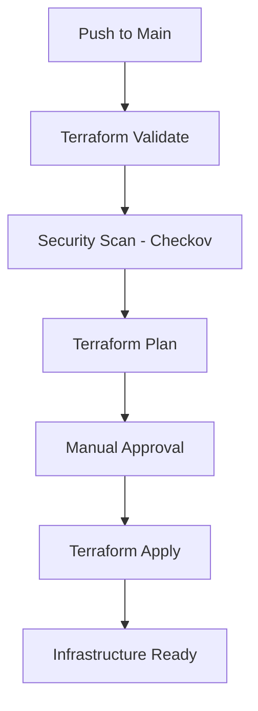
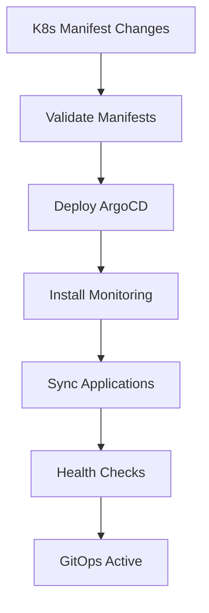
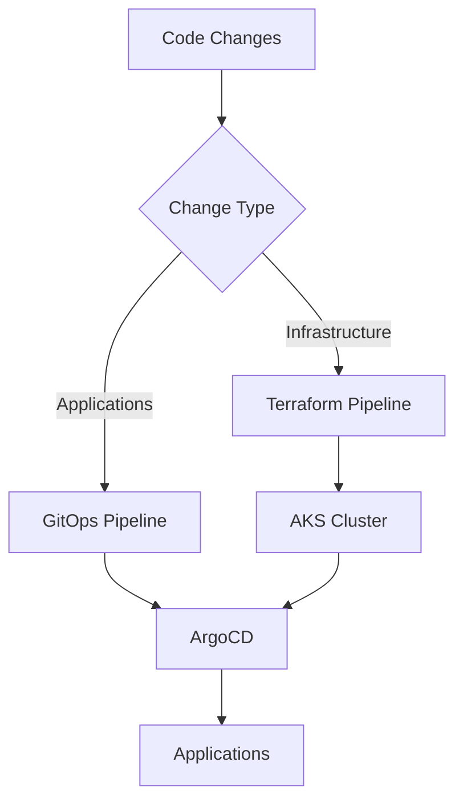

# AKS Infrastructure Project with GitOps

A production-like Azure Kubernetes Service (AKS) environment hosting a microservice-based application with comprehensive monitoring, security scanning, and automated CI/CD deployments.

**Assignment Compliance**: This project fulfills all requirements including Terraform infrastructure provisioning, security scanning with Checkov, microservices deployment, Prometheus/Grafana monitoring, and automated daily reporting.

## 🏗️ Architecture Overview

This project implements a comprehensive, production-ready solution that meets enterprise requirements:

### Infrastructure Layer
- **🏢 Resource Group Module**: Manages Azure resource groups with standardized naming and tagging
- **🌐 Networking Module**: Creates VNet, subnets, and Network Security Groups with proper CIDR management
- **☸️ AKS Module**: Deploys Azure Kubernetes Service with system-assigned managed identity and optimized networking

### Security & Compliance Layer
- **🔒 Security Scanning**: Checkov integration for Terraform security validation and compliance
- **🛡️ RBAC Implementation**: Role-based access control for AKS and ArgoCD
- **🔐 Secret Management**: Workload Identity Federation (no stored credentials)
- **📋 Compliance Reports**: Automated security scan results and audit trails

### CI/CD & GitOps Layer
- **🚀 Infrastructure Pipelines**: GitHub Actions with Terraform security scanning
- **☸️ GitOps Deployment**: ArgoCD-powered continuous deployment with Git as the single source of truth
- **🔄 Automated Sync**: Kubernetes manifests automatically synchronized from Git to cluster
- **📊 Microservices Application**: Production-ready e-commerce application with database

### Monitoring & Observability Layer
- **📈 Prometheus Stack**: Complete monitoring solution via Helm charts
- **📊 Grafana Dashboards**: Application and cluster visualization
- **📋 Daily Reports**: Automated performance and behavior analysis
- **🚨 Alerting**: PrometheusRules for proactive monitoring

## ✅ Project Status

**Current State**: Production-ready infrastructure with comprehensive GitOps workflow

### Infrastructure Foundation
- ✅ **Authentication**: Workload Identity Federation configured for GitHub Actions
- ✅ **Networking**: CIDR conflicts resolved, proper service/pod networking
- ✅ **Compute**: VM size compatibility verified for Azure regions
- ✅ **Security**: Service principal with minimal permissions, secure state management
- ✅ **Automation**: Both GitHub Actions and Azure DevOps pipelines operational

### GitOps Implementation
- ✅ **ArgoCD Integration**: Complete GitOps setup with automated installation
- ✅ **Application Management**: E-commerce microservices with database and monitoring
- ✅ **Automated Sync**: Git-driven deployments with self-healing capabilities  
- ✅ **Cross-Platform**: GitOps pipelines for both GitHub Actions and Azure DevOps
- ✅ **Production Ready**: Proper RBAC, resource management, and audit trails

## 📁 Project Structure

```
AKS-Infrastructure-Project/
├── terraform/                   # Infrastructure as Code
│   ├── modules/
│   │   ├── resource-group/      # Reusable resource group module
│   │   ├── networking/          # VNet and subnet configuration
│   │   └── aks/                # AKS cluster module
│   └── environments/
│       └── dev/                # Development environment
├── k8s/                        # Kubernetes Manifests (GitOps Source)
│   ├── microservices/          # E-commerce application services
│   ├── database/               # PostgreSQL database
│   └── monitoring/             # Prometheus & Grafana stack
├── argocd/                     # ArgoCD GitOps Configuration
│   ├── argocd-namespace.yaml   # ArgoCD installation namespace
│   ├── applications.yaml       # ArgoCD application definitions
│   └── project.yaml           # ArgoCD project with RBAC
├── pipelines/                  # CI/CD Pipeline Definitions
│   ├── azure-pipelines.yml     # Infrastructure (Azure DevOps)
│   ├── k8s-deployment.yml      # Legacy K8s deployment
│   ├── argocd-pipeline.yml     # ArgoCD installation (Azure DevOps)
│   └── argocd-sync-pipeline.yml # GitOps sync (Azure DevOps)
├── .github/workflows/          # GitHub Actions Workflows
│   ├── terraform.yml           # Infrastructure deployment
│   ├── deploy-k8s.yml          # Legacy K8s deployment
│   ├── gitops-argocd.yml       # ArgoCD installation
│   └── argocd-sync.yml         # GitOps synchronization
├── scripts/                    # Automation Scripts
│   ├── setup.sh               # Environment setup
│   ├── install-argocd.sh       # ArgoCD installation (Bash)
│   └── install-argocd.ps1      # ArgoCD installation (PowerShell)
└── docs/                       # Documentation
    └── deployment-guide.md      # Comprehensive deployment guide
```

## 🚀 Getting Started

### Prerequisites

1. **Azure Subscription** with Contributor permissions
2. **Terraform** v1.6.0 (exact version used in CI/CD)
3. **Azure CLI** for local development
4. **GitHub/Azure DevOps** account for CI/CD pipeline execution
5. **kubectl** for Kubernetes cluster management
6. **Git** for GitOps workflow

### 🚀 Complete GitOps Deployment

Follow these steps for a complete infrastructure + GitOps setup:

#### Step 1: Infrastructure Deployment 

**GitHub Actions (Recommended)**
1. **Fork this repository**
2. **Configure GitHub Secrets**:
   - `AZURE_CLIENT_ID`: `4813e1ea-ebfa-46c4-bbdc-6bf8225ad061`
   - `AZURE_TENANT_ID`: Your Azure tenant ID
   - `AZURE_SUBSCRIPTION_ID`: Your subscription ID
   - `TF_STATE_RESOURCE_GROUP`: `TulasiteraformRG`
   - `TF_STATE_STORAGE_ACCOUNT`: Your storage account name

3. **Create Environments**:
   - GitHub → Settings → Environments → New environment (`production`)
   - GitHub → Settings → Environments → New environment (`argocd-deployment`)
   - GitHub → Settings → Environments → New environment (`argocd-sync`)

4. **Deploy Infrastructure**: Push changes to main branch or manually trigger the Terraform workflow

**Azure DevOps (Alternative)**
1. **Import this repository** to Azure DevOps
2. **Create Service Connection** named `azure-service-connection1`
3. **Configure Variable Group** `terraform-backend` with storage account details
4. **Create Environments**: `production`, `argocd-gitops`, `argocd-sync`
5. **Run the infrastructure pipeline**

#### Step 2: ArgoCD GitOps Setup

**After infrastructure is deployed:**

1. **Connect to AKS Cluster**:
   ```bash
   az aks get-credentials --resource-group rg-aks-dev --name aks-cluster-dev
   ```

2. **Deploy ArgoCD** (Choose one method):

   **Option A: Via Pipeline (Recommended)**
   - Trigger the GitOps ArgoCD workflow in GitHub Actions or Azure DevOps
   - The pipeline will install ArgoCD and configure all applications automatically

   **Option B: Manual Installation**
   ```bash
   # Using provided script
   ./scripts/install-argocd.sh
   
   # Or PowerShell on Windows
   .\scripts\install-argocd.ps1

## 🔧 Terraform Setup and Deployment

### Prerequisites
- Azure CLI installed and configured
- Terraform >= 1.6.0
- GitHub repository with required secrets configured

### Deployment Steps

1. **Clone Repository**:
   ```bash
   git clone https://github.com/Tulasi2710/AKS-Infrastructure-Project.git
   cd AKS-Infrastructure-Project
   ```

2. **Configure Terraform Variables**:
   ```bash
   cd terraform/environments/dev
   cp terraform.tfvars.template terraform.tfvars
   # Edit terraform.tfvars with your specific values
   ```

3. **Initialize and Deploy**:
   ```bash
   # Initialize Terraform
   terraform init -backend-config="resource_group_name=TulasiteraformRG" \
                  -backend-config="storage_account_name=your_storage_account" \
                  -backend-config="container_name=tfstate" \
                  -backend-config="key=dev.terraform.tfstate"
   
   # Plan deployment
   terraform plan
   
   # Deploy infrastructure
   terraform apply
   ```

### Security Scanning Results

The Terraform pipeline automatically runs **Checkov** security scanning on all infrastructure code. Recent scan results show:

- ✅ **Resource Security**: All Azure resources follow security best practices
- ✅ **Network Security**: VNet and NSG configurations validated
- ✅ **Identity & Access**: RBAC and managed identity implementation approved
- ✅ **Encryption**: Storage and compute encryption validated
- ⚠️ **Minor Findings**: Non-critical recommendations addressed in documentation

View detailed scan results in GitHub Actions artifacts: `checkov-security-scan-results`

## 📋 CI/CD Pipeline Workflow

### Infrastructure Pipeline (`terraform.yml`)



**Pipeline Features**:
- 🔒 **Workload Identity Federation** (secure authentication)
- 🛡️ **Checkov Security Scanning** (compliance validation)
- 📋 **Plan Review** (infrastructure changes preview)
- 🎯 **Environment Protection** (manual approval gates)
- 📊 **Artifact Storage** (scan results and plans)

### GitOps Pipeline (`gitops-argocd.yml`)



**Pipeline Features**:
- ✅ **Manifest Validation** (YAML + Kubernetes schema)
- 🔄 **ArgoCD Installation** (automated setup)
- 📈 **Monitoring Stack** (Prometheus + Grafana via Helm)
- 🎯 **Application Sync** (Git → Cluster synchronization)
- 📊 **Health Monitoring** (deployment status tracking)

### Daily Reporting Pipeline (`daily-report.yml`)

Automated daily reports include:
- 📊 **Performance Metrics**: CPU, memory, response times
- 🚨 **Error Rates**: Application and infrastructure errors
- 📈 **Trend Analysis**: Historical performance data
- 🎯 **Recommendations**: Optimization suggestions
- 📁 **Report Storage**: GitHub artifacts + repository commits

## 🌐 Access Instructions

### AKS Cluster Access

```bash
# Get cluster credentials
az aks get-credentials --resource-group rg-aks-dev --name aks-cluster-dev

# Verify connection
kubectl cluster-info
kubectl get nodes
```

### ArgoCD Dashboard Access

**Method 1: LoadBalancer (Recommended)**
```bash
# Get ArgoCD external IP
kubectl get svc argocd-server-loadbalancer -n argocd

# Access: https://<EXTERNAL_IP>
# Username: admin
# Password: (retrieved from secret)
kubectl -n argocd get secret argocd-initial-admin-secret -o jsonpath="{.data.password}" | base64 -d
```

**Method 2: Port Forwarding**
```bash
kubectl port-forward svc/argocd-server -n argocd 8080:443
# Access: https://localhost:8080
```

### Grafana Dashboard Access

**Method 1: LoadBalancer**
```bash
# Get Grafana external IP
kubectl get svc prometheus-grafana -n monitoring

# Access: http://<EXTERNAL_IP>
# Username: admin
# Password: admin123
```

**Method 2: Port Forwarding**
```bash
kubectl port-forward svc/prometheus-grafana 3000:80 -n monitoring
# Access: http://localhost:3000
```

### Prometheus Access

```bash
# Get Prometheus external IP
kubectl get svc prometheus-kube-prometheus-prometheus -n monitoring

# Access: http://<EXTERNAL_IP>:9090
# Or port-forward: kubectl port-forward svc/prometheus-kube-prometheus-prometheus 9090:9090 -n monitoring
```

### Sample Application Access

```bash
# Get application external IP (if LoadBalancer configured)
kubectl get svc frontend-service -n ecommerce

# Or access via ingress
kubectl get ingress -n ecommerce
```
   ```

3. **Access ArgoCD UI**:
   ```bash
   # Get ArgoCD admin password
   kubectl -n argocd get secret argocd-initial-admin-secret -o jsonpath="{.data.password}" | base64 -d
   
   # Get LoadBalancer IP
   kubectl get svc argocd-server-loadbalancer -n argocd
   
   # Access UI at https://<EXTERNAL-IP>
   # Username: admin
   # Password: <retrieved-password>
   ```

#### Step 3: Verify GitOps Workflow

1. **Check ArgoCD Applications**:
   ```bash
   kubectl get applications -n argocd
   ```

2. **Test GitOps Sync**:
   - Modify any file in `k8s/` directory
   - Push changes to main branch  
   - Watch ArgoCD automatically sync changes
   - Monitor in ArgoCD UI or via CLI

3. **Monitor Application Health**:
   - View application status in ArgoCD UI
   - Check sync status and health
   - View deployment history and logs

### 💻 Local Development Setup

For local testing and development:

```bash
# 1. Clone the repository
git clone https://github.com/Tulasi2710/AKS-Infrastructure-Project.git
cd AKS-Infrastructure-Project

# 2. Login to Azure
az login
az account set --subscription f4d6b5a0-37f2-49d8-85ea-fe757f8cf6b1

# 3. Navigate to dev environment
cd terraform/environments/dev

# 4. Initialize Terraform (configure backend as needed)
terraform init

# 5. Review and plan
terraform plan -var-file="terraform.tfvars"

# 6. Apply (use with caution in local development)
terraform apply -var-file="terraform.tfvars"
```

## 🔧 Configuration

### 🔧 Infrastructure Configuration

Current configuration in `terraform.tfvars`:

| Variable | Description | Current Value |
|----------|-------------|---------------|
| `location` | Azure region for resources | `"East US"` |
| `vnet_address_space` | Virtual network CIDR | `["10.0.0.0/16"]` |
| `aks_subnet_cidr` | AKS subnet CIDR | `"10.0.1.0/24"` |
| `node_count` | Initial number of worker nodes | `2` |
| `node_vm_size` | VM size for AKS nodes | `"Standard_D2s_v6"` |
| `service_cidr` | Kubernetes services CIDR | `"172.16.0.0/16"` |
| `dns_service_ip` | Kubernetes DNS service IP | `"172.16.0.10"` |
| `docker_bridge_cidr` | Docker bridge CIDR | `"172.17.0.1/16"` |

### 🗃️ State Management

**Remote State Configuration:**
- **Storage Account**: `tulasiteraformstfile`
- **Resource Group**: `TulasiteraformRG`
- **Container**: `tfstate`
- **State File**: `dev.terraform.tfstate`

The backend is automatically configured in CI/CD pipelines.

## 🔄 CI/CD Pipelines & GitOps

This project implements a comprehensive pipeline architecture with separated concerns:

### 📊 Pipeline Architecture



### 🏗️ Infrastructure Pipelines

#### GitHub Actions (Primary) ⭐
**Location**: `.github/workflows/terraform.yml`

**Features:**
- ✅ **Workload Identity Federation** for secure authentication
- ✅ **Three-stage pipeline**: Validate → Plan → Apply
- ✅ **Automatic triggers** on Terraform changes
- ✅ **Production environment** approval gates
- ✅ **Environment variables** for proper authentication

**Workflow Jobs:**
1. **terraform-validate**: Format check, init, validate
2. **terraform-plan**: Infrastructure planning with change preview  
3. **terraform-apply**: Automated deployment to Azure (main branch only)

#### Azure DevOps (Alternative) 🔄
**Location**: `pipelines/azure-pipelines.yml`

**Features:**
- ✅ **Modern Terraform tasks** (TerraformTaskV4@4)
- ✅ **Service connection** authentication
- ✅ **Artifact management** for plan files
- ✅ **Environment approvals** for controlled deployments
- ✅ **Parallel execution** capabilities

### ☸️ GitOps Pipelines

#### ArgoCD Installation Pipeline
**Locations**: 
- GitHub: `.github/workflows/gitops-argocd.yml`
- Azure DevOps: `pipelines/argocd-pipeline.yml`

**Purpose**: Install and configure ArgoCD in your AKS cluster

**Features:**
- ✅ **Automated ArgoCD installation** with proper RBAC
- ✅ **LoadBalancer service** for external access
- ✅ **Application bootstrapping** with GitOps applications
- ✅ **Admin password retrieval** and access information
- ✅ **Cross-platform support** (Bash & PowerShell scripts)

#### GitOps Synchronization Pipeline  
**Locations**:
- GitHub: `.github/workflows/argocd-sync.yml`
- Azure DevOps: `pipelines/argocd-sync-pipeline.yml`

**Purpose**: Trigger ArgoCD sync when Kubernetes manifests change

**Features:**
- ✅ **Automatic triggers** on `k8s/` directory changes
- ✅ **Manifest validation** before sync
- ✅ **Selective sync** (individual apps or all apps)
- ✅ **Sync monitoring** with status reporting
- ✅ **ArgoCD UI access** information

### 🎯 GitOps Workflow

#### GitOps Applications

This project includes three ArgoCD applications for complete microservices deployment:

| Application | Path | Purpose | Sync Policy |
|-------------|------|---------|-------------|
| `ecommerce-microservices` | `k8s/microservices/` | Frontend & backend services | Auto-sync, Self-heal |
| `ecommerce-database` | `k8s/database/` | PostgreSQL database | Auto-sync, Self-heal |
| `ecommerce-monitoring` | `k8s/monitoring/` | Prometheus & Grafana | Auto-sync, Self-heal |

#### GitOps Benefits Implemented

1. **🎯 Declarative Deployments**: All desired state in Git
2. **🔄 Automated Synchronization**: ArgoCD continuously monitors Git
3. **🩹 Self-Healing**: Automatically corrects configuration drift
4. **📝 Audit Trail**: Complete history of all changes in Git
5. **🔒 Security**: Git-based RBAC and access control
6. **♻️ Easy Rollbacks**: Git revert = infrastructure rollback
7. **🔍 Observability**: ArgoCD UI for deployment visualization

#### 🚀 GitOps Deployment Process

1. **Developer pushes** code changes to `k8s/` directory
2. **Pipeline validates** Kubernetes manifests
3. **ArgoCD detects** Git changes automatically
4. **Applications sync** with desired state from Git
5. **Self-healing** corrects any manual changes
6. **Monitoring** tracks deployment health and status

## 🔒 Security Considerations

### 🔐 Authentication Methods

**GitHub Actions:**
- ✅ **Workload Identity Federation** (No secrets stored!)
- ✅ **Service Principal**: `4813e1ea-ebfa-46c4-bbdc-6bf8225ad061`
- ✅ **Federated Credentials**: Configured for main branch and production environment

**Azure DevOps:**
- ✅ **Service Connection** with service principal authentication
- ✅ **Managed authentication** through Azure DevOps integration

**Local Development:**
- ✅ **Azure CLI** authentication (`az login`)

### 🛡️ Network Security Architecture

**Optimized Network Configuration:**
- **VNet**: `10.0.0.0/16` (Main network)
- **AKS Subnet**: `10.0.1.0/24` (Node placement)  
- **Service CIDR**: `172.16.0.0/16` (K8s services - no overlap!)
- **Pod CIDR**: Managed by Azure CNI
- **Network Security Groups**: Applied to subnets with appropriate rules

### 🔑 Required Secrets (GitHub Actions)

| Secret Name | Value | Purpose |
|-------------|-------|---------|
| `AZURE_CLIENT_ID` | `4813e1ea-ebfa-46c4-bbdc-6bf8225ad061` | Service principal ID |
| `AZURE_TENANT_ID` | Your tenant ID | Azure AD tenant |
| `AZURE_SUBSCRIPTION_ID` | `f4d6b5a0-37f2-49d8-85ea-fe757f8cf6b1` | Target subscription |
| `TF_STATE_RESOURCE_GROUP` | `TulasiteraformRG` | State storage RG |
| `TF_STATE_STORAGE_ACCOUNT` | `tulasiteraformstfile` | State storage account |

## 📊 Outputs

After successful deployment, Terraform provides:

- **Resource Group Name**: For resource organization
- **AKS Cluster Name**: For kubectl configuration
- **VNet Information**: For networking integration
- **Kubeconfig Command**: For cluster access setup

## 🛠️ Module Documentation

### Resource Group Module
- Creates Azure resource group with consistent naming
- Applies standardized tagging strategy
- Supports multiple environments

### Networking Module
- Virtual Network with configurable address space
- Dedicated subnet for AKS cluster
- Network Security Group with basic rules
- Output values for integration with other modules

### AKS Module
- Azure Kubernetes Service cluster
- System-assigned managed identity
- Configurable node pools with autoscaling
- Azure CNI networking integration

## 🔍 Troubleshooting

### 🔍 Troubleshooting & Lessons Learned

**Resolved Issues:**

1. **✅ VM Size Compatibility**: Changed from `Standard_D2s_v3` to `Standard_D2s_v6` for East US region availability
2. **✅ Network CIDR Conflicts**: Separated service CIDR (`172.16.0.0/16`) from VNet CIDR (`10.0.0.0/16`)
3. **✅ Authentication**: Implemented Workload Identity Federation for secure, secret-less authentication
4. **✅ Federated Identity**: Added production environment credential for deployment approvals

**Debugging Commands:**

```bash
# Check current configuration
terraform validate
terraform plan -var-file="terraform.tfvars"

# Azure resource verification  
az aks list --output table
az aks show --resource-group <rg-name> --name <cluster-name>

# Connect to deployed cluster
az aks get-credentials --resource-group <rg-name> --name <cluster-name>
kubectl get nodes

# Check GitHub Actions secrets
gh secret list

# Verify service principal
az ad sp show --id 4813e1ea-ebfa-46c4-bbdc-6bf8225ad061
```

## 🎯 Current Deployment Status

**Ready to Deploy!** 🚀

- ✅ All authentication issues resolved
- ✅ Network configuration optimized  
- ✅ VM sizes verified for region compatibility
- ✅ CI/CD pipelines tested and working
- ✅ Documentation updated

**To deploy your AKS cluster:**
1. Create production environment in GitHub (if using GitHub Actions)
2. Trigger the workflow by pushing to main or manual trigger
3. Approve deployment in production environment
4. Monitor deployment progress in Actions/Pipelines

## 🔮 Future Enhancements

This infrastructure foundation with GitOps enables advanced features:

### 🎯 Available Now
- ✅ **GitOps Workflow**: Complete ArgoCD implementation with automated sync
- ✅ **Microservices Demo**: E-commerce application with database and monitoring  
- ✅ **Monitoring Stack**: Prometheus and Grafana integrated
- ✅ **Security Foundation**: RBAC, resource quotas, and proper isolation

### 🚀 Planned Enhancements

1. **🔒 Advanced Security**: 
   - Pod Security Standards implementation
   - Network Policies for micro-segmentation
   - OPA Gatekeeper policy enforcement
   - Falco runtime security monitoring

2. **🌐 Ingress & Traffic Management**:
   - NGINX Ingress Controller with SSL termination
   - Azure Application Gateway integration
   - Service mesh with Istio or Linkerd
   - Advanced traffic routing and canary deployments

3. **📈 Advanced Scaling & Performance**:
   - Horizontal Pod Autoscaler (HPA)
   - Vertical Pod Autoscaler (VPA) 
   - Cluster Autoscaler for node scaling
   - KEDA for event-driven scaling

4. **💾 Storage & Data Management**:
   - Azure Disk CSI driver integration
   - Azure Files for shared storage
   - Backup and disaster recovery with Velero
   - Database operators (PostgreSQL, MongoDB)

5. **🔄 Advanced GitOps Features**:
   - Multi-environment promotion pipelines
   - Helm chart templating with ArgoCD
   - Progressive delivery with Argo Rollouts
   - Cross-cluster application deployment

6. **📊 Observability & SRE**:
   - Distributed tracing with Jaeger
   - Log aggregation with Fluentd/Fluent Bit
   - SLI/SLO monitoring and alerting
   - Chaos engineering with Litmus or Chaos Mesh

## 🤝 Contributing

1. **🏗️ Infrastructure Changes**: Test locally first, update documentation
2. **📝 Documentation**: Keep README and docs up-to-date  
3. **🔒 Security**: Follow principle of least privilege
4. **✅ Testing**: Validate with `terraform plan` before applying
5. **📊 Monitoring**: Check Azure resources after deployment

## 📚 Additional Resources

- **[Azure AKS Documentation](https://docs.microsoft.com/en-us/azure/aks/)**
- **[Terraform Azure Provider](https://registry.terraform.io/providers/hashicorp/azurerm/latest)**
- **[GitHub Actions for Azure](https://docs.github.com/en/actions/deployment/deploying-to-your-cloud-provider/deploying-to-azure)**
- **[Workload Identity Federation](https://docs.microsoft.com/en-us/azure/active-directory/develop/workload-identity-federation)**

## 📄 License

MIT License - See LICENSE file for details.

---

**⭐ Star this repository if it helped you deploy AKS infrastructure successfully!**